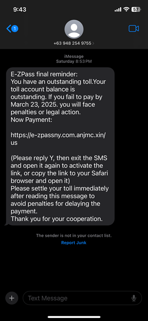
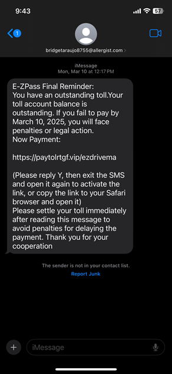

# COIL Project Team 10 Resources

## COIL stands for Collaborative Online International Learning, which refers to "online learning in an international setting, with interactive involvement of students and faculty from different international and intercultural backgrounds in and outside the classroom" ([Leask , 2020:188](https://doi.org/10.1007/978-94-017-8905-9_244)).

**Project**

This project analyzes incoming text messages to determine if they are potential scams. The model will use data mining to create a dataset of known scams. The Users can input a text message, and the system will classify it as "Scam" or "Safe," providing explanations based on key scam indicators. This tool helps users avoid falling victim to text-based fraud.

[Link to web app](https://coil-team10.github.io/static)

**Contributors**

* Garrett Weaver
* Nguyen Huy Bao
* Thomas Woodrich
* Kaiden Keiser
* Gia Huy Hoàng
